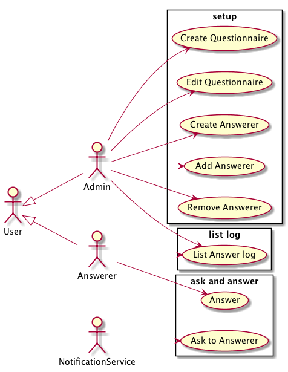
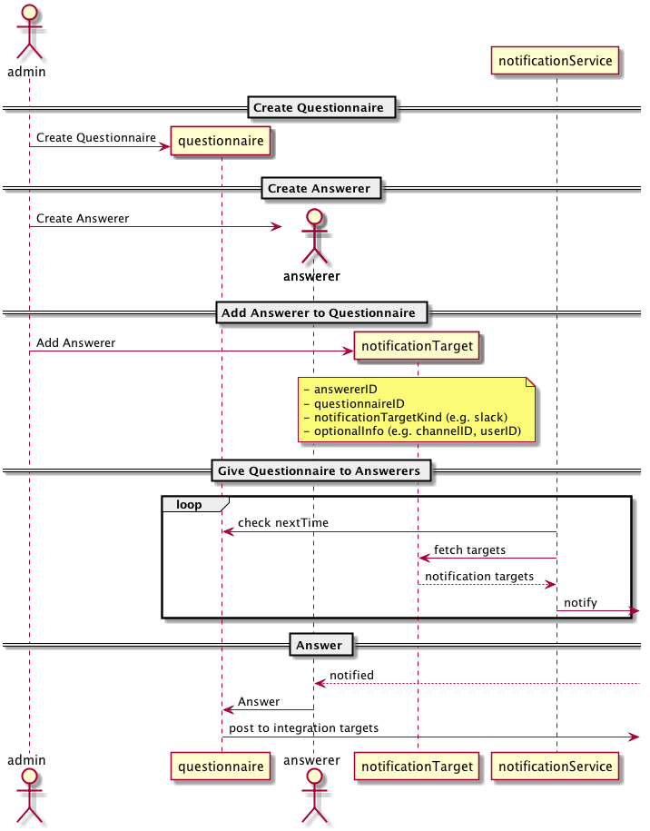
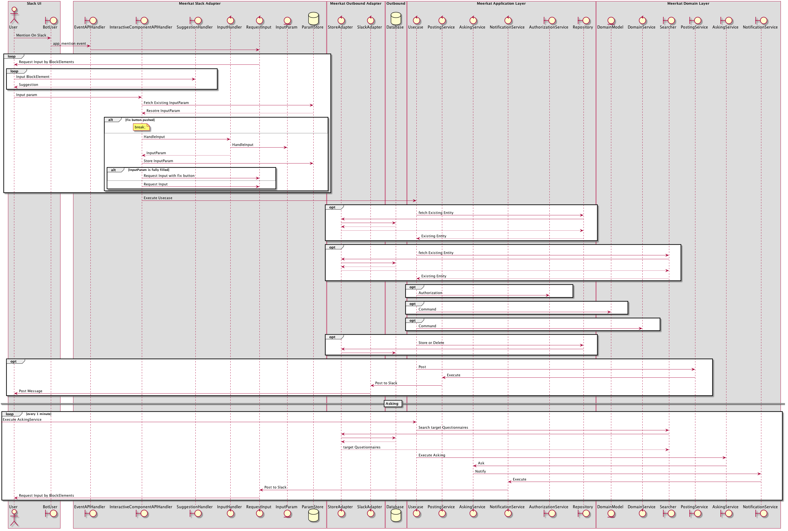

Meerkat
=======

## Usecases

## Usage flow

## Interaction flow with Slack

## Feature

- [x] CreateQueastionnaire
    - [x] Questions
        - [ ] Reuse existing questions
    - [x] Schedule
        - [x] WeekdayAndTimeSchedule
    - [x] ScheduleException
        - [x] YearMonthDayScheduleException
    - [x] PostTarget
- [x] EditQuestionnaire
- [ ] DisableQuestionnaire
- [x] CreateAnswerer
- [ ] RemoveAnswerer
- [ ] Authorization
- [x] [Ask Answers (Notify)](./adapter/cmd/ask_all_if_needed)
    - [ ] deploy
    - [ ] execute every 1 minutes
- [x] PostAnswer
- [ ] list (search) questionnaires
- [ ] list (search) answers
- [ ] list (search) answerers
- [x] Inmemory persistence
- [x] DynamoDB persistence
    - [x] [InitializeTable](./adapter/cmd/create_dynamodb_table)
- [x] [HTTP Server For Slack interface](./adapter/slack/cmd/meerkat-slackhttphandler)
- [x] [Lambda Server (with API Gateway) For Slack interface](./adapter/slack/cmd/meerkat-slackapigatewayhandlerbylambda)

## Slack commands

Use AppMentionEvent

- `@meerkat createQuestionnaire`
- `@meerkat editQuestionnaire {questionnaireID}`
- `@meerkat createAnswerer`
- `@meerkat addAnswerer`

## Usage

### Lambda with API Gateway

1. create slack apps [https://api.slack.com/apps?new_app=1](https://api.slack.com/apps?new_app=1)
    - allow scope ( `chat:write:bot`, `bot` )
2. init conf yaml [./deploytool/lambda/meerkat-slackapigatewayhandlerbylambda.yaml](./deploytool/lambda/meerkat-slackapigatewayhandlerbylambda.yaml)
3. deploy by [./deploytool/lambda/deploy.go](./deploytool/lambda/deploy.go)
4. setup API Gateway
    - setup path for [./adapter/slack/cmd/meerkat-slackapigatewayhandlerbylambda](./adapter/slack/cmd/meerkat-slackapigatewayhandlerbylambda/main.go)
        - `/slack/suggestion`
        - `/slack/event`
        - `/slack/interactive_component`
    - deploy and get public URL
5. config slack apps
    - Interactive Component
        - Interactivity
        - Message Menus
    - Event Subscriptions
        - Subscribe to Bot Events `app_mention`
    - Bot Users
6. create DynamoDB Tables
    - [./adapter/cmd/create_dynamodb_table](./adapter/cmd/create_dynamodb_table)
6. TODO: setup NotificationService execution with [./adapter/cmd/ask_all_if_needed](./adapter/cmd/ask_all_if_needed)
